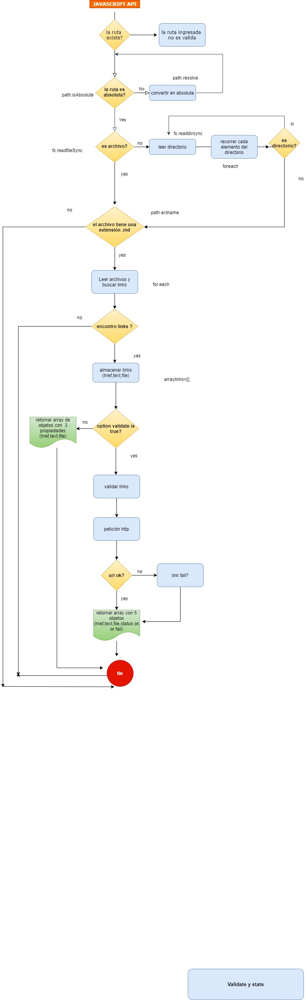
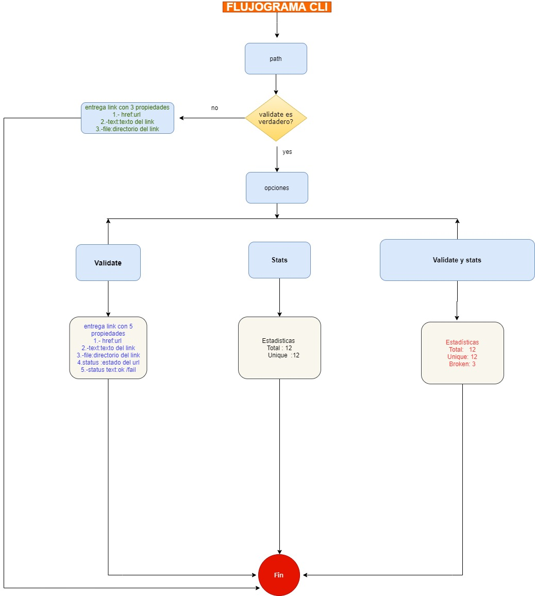

#  Libreria Markdown Links


## **Diagramas de Flujo**






## **Modo de uso**

**JAVASCRIPT API**

- **Importa como módulo**
```javascript
const { mdLinks } = require('mdlinks');

```
Por ejemplo:

```javascript
const { mdLinks } = require("mdlinks");

mdLinks("./some/example.md")
  .then(links => {
    // => [{ href, text, file }]
  })
  .catch(console.error);

mdLinks("./some/example.md", { validate: true })
  .then(links => {
    // => [{ href, text, file, status, ok }]
  })
  .catch(console.error);

mdLinks("./some/dir")
  .then(links => {
    // => [{ href, text, file }]
  })
  .catch(console.error);

```


### CLI (Command Line Interface - Interfaz de Línea de Comando)

El ejecutable de nuestra aplicación se puede  ejecutar de la siguiente
manera a través de la terminal:

```
md-links <ruta del archivo> [opciones]
```


####  Sin opciones

```javascript
$ md-links 'data/try.md.'
  HREF: https://nodejs.org/es/about/
  TEXT: Node.js http.get - Documentación oficial
  PATH: C:\Users\jael\Desktop\test\data\try.md
```


#### Opciones

#####  Opción `--validate`

Si pasamos la opción `--validate`, el módulo debe hacer una petición HTTP para
averiguar si el link funciona o no. Si el link resulta en una redirección a una
URL que responde ok, entonces consideraremos el link como ok.


```javascript
$ md-links 'data/try.md' --validate

  HREF: https://nodejs.org/es/about/
  TEXT: Acerca de Node.js - Documentación oficial
  PATH: C:\\Users\\Estudiante\\Desktop\\LIM012-fe-md-links\\test\\data2\\hoja.txt
  STATUS: 200
  STATUSTEXT: OK

  HREF: https://nodejs.org/api/http.html#http_http_get_options_callback
  TEXT: Node.js http.get - Documentación oficial
  PATH: C:\\Users\\jael\\Desktop\\LIM012-fe-md-links\\test\\data2\\hoja.txt
  STATUS:404
  STATUSTEXT: fail
```
Vemos que el _output_ en este caso incluye la palabra `ok` o `fail` después de
la URL, así como el status de la respuesta recibida a la petición HTTP a dicha
URL.

##### Opción `--stats`

Si pasamos la opción `--stats` el output (salida) será un texto con estadísticas
básicas sobre los links.

```javascript
$ md-links 'data/try.md' --stats
   TOTAL: 5
   UNIQUE: 5
```

##### Opción `--stats` y --validate

También podemos combinar `--stats` y `--validate` para obtener estadísticas que
necesiten de los resultados de la validación.


```javascript
$ md-links 'data/prueba1.md' --stats --validate
   TOTAL: 5
   UNIQUE: 5
   BROKEN: 1
```


### Javascript
- [x] Uso de callbacks
- [x] Consumo de Promesas
- [x] Creacion de Promesas
- [x] Modulos de Js
- [x] Recursión

### Node
- [ ] Sistema de archivos
- [x] package.json
- [x] crear modules
- [x] Instalar y usar modules
- [ ] npm scripts
- [ ] CLI (Command Line Interface - Interfaz de Línea de Comando)

### Testing
- [x] Testeo de tus funciones
- [ ] Testeo asíncrono
- [ ] Uso de librerias de Mock
- [ ] Mocks manuales
- [ ] Testeo para multiples Sistemas Operativos

### Git y Github
- [ ] Organización en Github

### Buenas prácticas de desarrollo
- [x] Modularización
- [x] Nomenclatura / Semántica
- [x] Linting


